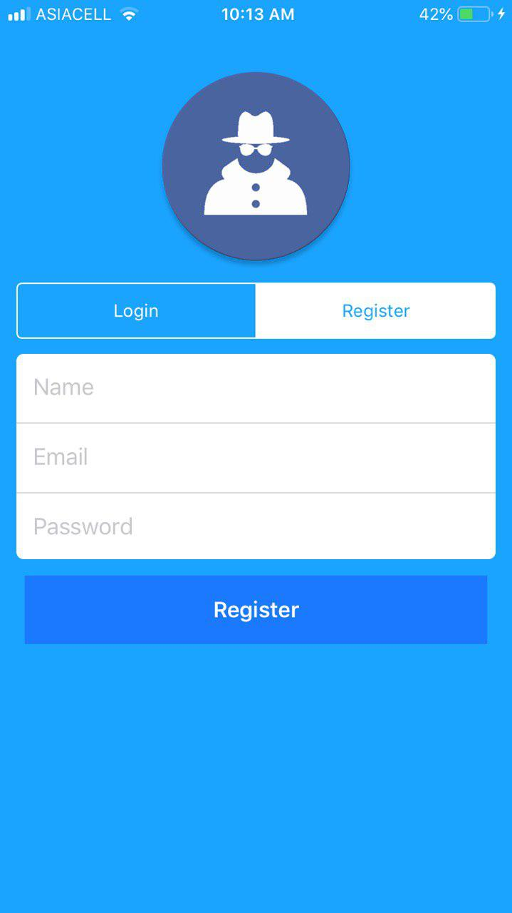
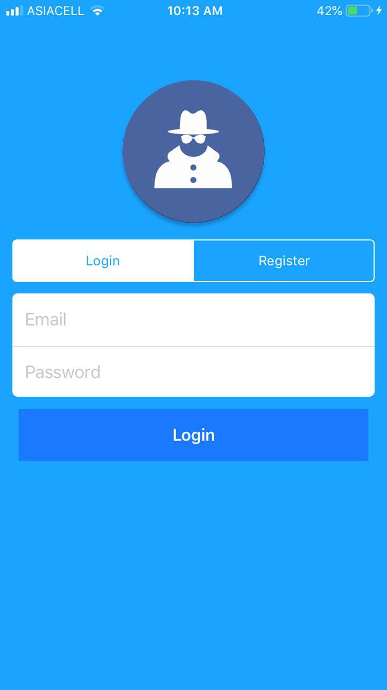

# ChatApp-swift-ios
<h2><b>A realtime chat app made for ios using swift,xcode and firebase</b></h2>
<h3><code>ios 9 and above</code></h3>

<h3><code>pods used</code></h3>
<ol>
  <li>Firebase/Database</li>
  <li>Firebase/Auth</li>
  <li>Firebase/Storage</li>
  <li>SnapKit</li>
</ol>

<h2>Images :</h2>
<ol>
  <li></li>
  <li></li>
  <li></li>
  <li></li>
  <li></li>
</ol>
 

<code>ps : there is a 2nd edition of this app that uses end-to-end-encryption under development . </code>

